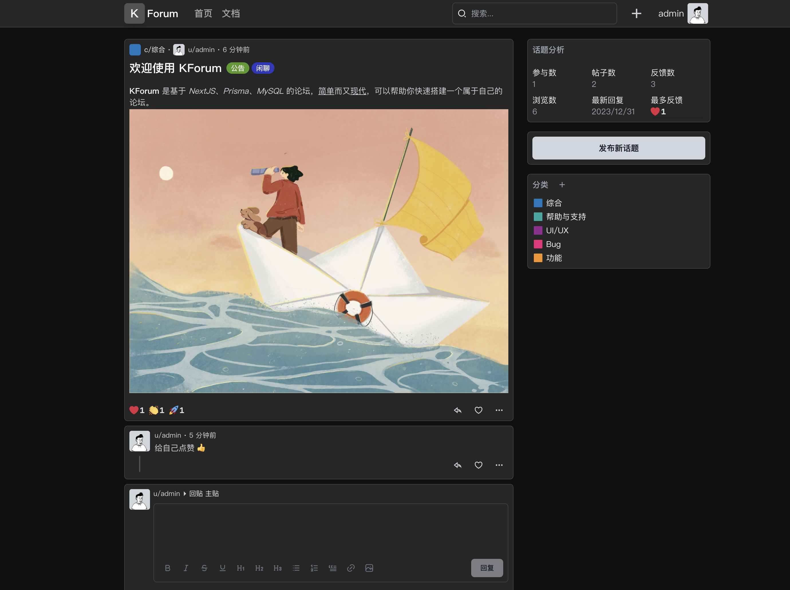

# KForum

A Simple, Modern and Beautiful Forum.



## Build With

* Framework: NextJS
* Database: Sqlite(v0.5.0) MySQL(^v0.6.0)
* ORM: Prisma
* Auth: Next Auth
* State: Zustand
* Styling: NextUI、Tailwind CSS、Headless UI

## Running Locally

Running MySQL first. Rename .env.example to .env. Set DATABASE_URL.

```shell
cd kforum
pnpm install
pnpm prisma db push
pnpm prisma db seed
pnpm dev
```

admin user:

```text
user: admin
pass: 123123
```

## Running Docker

```shell
docker-compose up -d
```

that's all, enjoy.

## Other

NextJS is amazing, you can build a website instantly. And if your website is growing big, you can easily rewrite your backend in any other languages(Java, Go, Rust, etc...).
